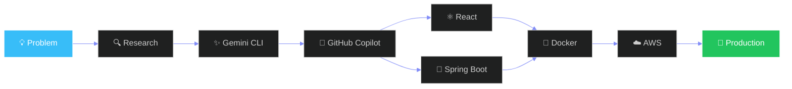

<div align="center">


<br>


<br><br>


</div>

<br>


<br>

## 🖥️ &nbsp;`whoami`

```bash
$ whoami

> Puneeth Kumar P
> Full Stack Developer · Product Engineer · AI-Powered Builder

> Currently     → Product Support Engineer Intern @ Meltwater
> Previously    → Ziko Home · Zenixus · ShadowFox
> Location      → Bengaluru, India
> Mission       → Build useful software. Automate repetitive work. Ship with ownership.
```

<br>


<br>

## 🎯 &nbsp;`/now`

<table width="100%">
<tr>
<td valign="top" width="33%">

### 🔨 Building
- GSD Script Runner
- Portfolio v2
- AI Dev Workflows

</td>
<td valign="top" width="33%">

### 🧠 Focused On
- Full-Stack Engineering
- AI-Assisted Development
- Internal Dev Platforms

</td>
<td valign="top" width="33%">

### 📚 Learning
- Kubernetes
- AWS
- System Design

</td>
</tr>
</table>

<br>

## 🧰 &nbsp;`/tech-stack`

<div align="center">

**Languages**


**Frontend**


**Backend**


**Databases**


**DevOps & Cloud**


**Tools & AI**


</div>

<br>


<br>

## 💼 &nbsp;`/experience`

<details open>
<summary><b>🏢 Meltwater — Product Support Engineer Intern</b> <code>Jan 2026 → Present</code></summary>
<br>

```diff
+ Product Support Rotation — Jira & Intercom workflows, client issue resolution
+ Internal Engineering Rotation — built GSD, a full-stack automation platform
+ Cross-functional collaboration with Engineering & Product teams
+ Git-based CI/CD pipelines in an enterprise environment
```

**🚀 Featured: GSD Script Runner**
Internal automation platform for engineering teams.

`React` `Node.js` `MongoDB` `Docker` `Kubernetes` `AWS` `CI/CD`

</details>

<details>
<summary><b>🏠 Ziko Home — Freelancer & Full-Stack Developer</b> <code>Apr 2026 → Present</code></summary>
<br>

```diff
+ Sole developer & IT lead — owned the entire stack solo
+ Direct client communication — requirements, scope, delivery
+ AI-assisted delivery using Gemini CLI & GitHub Copilot
+ End-to-end architecture, build, and deployment
```

</details>

<details>
<summary><b>🎓 Zenixus E-Learning — Full-Stack Developer Intern</b> <code>May – Jul 2024</code></summary>
<br>

```diff
+ Spring Boot + Angular full-stack development
+ Mentored junior developers
+ Integrated AI tools into team workflow
```

</details>

<details>
<summary><b>🐍 ShadowFox — Python Developer Intern</b> <code>May 2025</code></summary>
<br>

```diff
+ Data analysis & visualization in Jupyter Notebook
+ Real-world dataset cleaning & exploration
+ AI-assisted problem solving with GitHub Copilot
```

</details>

<br>


<br>

## 🚀 &nbsp;`/featured-projects`

<table width="100%">
<tr>
<td width="50%" valign="top">

### ⚙️ Smart Campus Scheduler
Resource booking platform for academic institutions — auth, real-time availability, admin CRUD.

`React` `Spring Boot` `MySQL` `Gemini CLI`

</td>
<td width="50%" valign="top">

### 🛠️ GSD Script Runner
Internal developer automation platform built at Meltwater. Production-grade, enterprise scale.

`Node.js` `MongoDB` `Docker` `Kubernetes` `AWS`

</td>
</tr>
<tr>
<td width="50%" valign="top">

### 🏆 KarigaarVerse
National-level SAP Hackfest project — digital marketplace for Indian artisans.

`Python` `Streamlit` `SQLite` `ChatGPT`

</td>
<td width="50%" valign="top">

### 🐾 Pet Adoption Portal
Complete adoption management system — listings, search, admin flow.

`Java` `JSP` `Hibernate` `MySQL`

</td>
</tr>
</table>

<br>


<br>

## 🔄 &nbsp;`/engineering-workflow`



<br>


<br>

## 🏆 &nbsp;`/achievements`

<table width="100%">
<tr>
<td align="center" width="20%">

🥇<br><b>Yukthi V10</b><br><sub>1st Place Winner</sub>

</td>
<td align="center" width="20%">

🚀<br><b>SAP Hackfest 2025</b><br><sub>National Round 2</sub>

</td>
<td align="center" width="20%">

🎤<br><b>Yukthi V11</b><br><sub>Event Host</sub>

</td>
<td align="center" width="20%">

👔<br><b>FOSS Club</b><br><sub>Vice President</sub>

</td>
<td align="center" width="20%">

🤝<br><b>Rotaract Club</b><br><sub>President & VP</sub>

</td>
</tr>
</table>

<br>

## 🎖️ &nbsp;`/leadership`

<table width="100%">
<tr>
<td valign="top" width="33%">

**👔 VP — FOSS Club**
- Organized TRITECHX
- Challenge design
- Judging coordination

</td>
<td valign="top" width="33%">

**🤝 President — Rotaract**
- Community initiatives
- PR management
- Social media ops

</td>
<td valign="top" width="33%">

**🧑‍💻 Team Lead — SAP Hackfest**
- Led Team Geeky Coders
- Rapid AI prototyping
- National competition

</td>
</tr>
</table>

<br>


<br>

## 📊 &nbsp;`/github-stats`

<div align="center">


<br><br>


<br><br>


</div>

<br>


<br>

<div align="center">

## 🌐 &nbsp;`/connect`

<a href="https://puneethkumar.me"></a>
<a href="https://linkedin.com/in/YOUR_LINKEDIN"></a>
<a href="mailto:puneeth.09.2002@gmail.com"></a>
<a href="https://github.com/PuneethKumarPuni"></a>

<br><br>

```bash
Build useful software. Automate repetitive work.
Lead with ownership. Ship products that create value.
```

<br>

<i>"Let's build something meaningful."</i>

</div>


